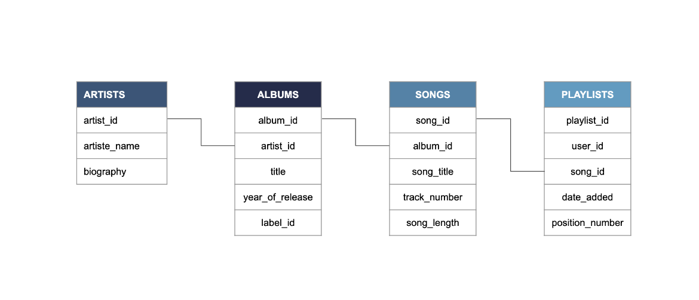

# Understanding Data Engineering

## About the Course

Conceptual course

No coding involved

## Objectives

- Being able to exchange with data engineers
- Provide a solid foundation to learn more

## Chapter 1: What is Data Engineering?

### Topics Covered
1. Data engineering and big data
2. Data engineers vs. data scientists
3. Data pipelines

### How Data Flows (Data Workflow)
1. Data collection and storage
2. Data preparation
3. Exploration and visualization
4. Experimentation & prediction

Data engineers are responsible for step 1.

### Data Engineers
They deliver data in the right form, correct data to right people as efficiently as possible. They:
- Ingest data from different sources
- Optimize databases for analysis
- Remove corrupted data
- Develop, construct, test, and maintain data architectures

As big data becomes the norm, more data engineers are needed.

### The 5 V's of Big Data
1. **Volume** - how much
2. **Variety** - what kind
3. **Velocity** - how frequent
4. **Veracity** - how accurate
5. **Value** - how useful

### Data Engineers vs Data Scientists

| Data Engineer        | Data Scientist    |
| -------------------- | ----------------- |
| Ingest, store data   | Exploit data      |
| Setup databases      | Access databases  |
| Build data pipelines | Analyze data      |

### The Data Pipeline
We Ingest, Process, Store - to do that we need pipelines. They:
- Automate the flow
- Ensure an efficient flow of data
- Extract, Transform, Validate, Load

**ETL Process:**
1. **Extract** data
2. **Transform** data
3. **Load** data


---

# Chapter 2: Data Structure

## Topics Covered

1. Structured vs. unstructured data
    
2. SQL
    
3. Data warehouses and data lakes
    

---

## Structured Data

- Easy to search and organize
    
- Consistent and typed
    
- Can be grouped and filtered
    
- Stored in relational databases
    

---

## SQL

**Structured Query Language**

- Standard for Relational Database Management Systems (RDBMS)
    
- Supports filtering, grouping, and aggregation
    
- Syntax similar to written English
    
- Used by data engineers to build and maintain databases
    
- Used by data scientists to request data for analysis
    

### For data engineers

```sql
CREATE TABLE employees (
  employee_id INT,
  first_name VARCHAR(255),
  last_name VARCHAR(255),
  role VARCHAR(255),
  team VARCHAR(255),
  full_time BOOLEAN,
  office VARCHAR(255)
);
```

### For data scientists

```sql
SELECT first_name, last_name
FROM employees
WHERE role LIKE '%Data%';
```


---

## Database schemas

- Databases consist of tables
    
- A schema defines table layout and relationships
    



Learn more: [https://www.geeksforgeeks.org/dbms/database-schemas/](https://www.geeksforgeeks.org/dbms/database-schemas/)

### Common SQL flavours

- SQLite
    
- MySQL
    
- PostgreSQL
    
- Oracle SQL
    
- SQL Server
    

---

## Data lakes and data warehouses

### Data lake

- Stores raw data in any format (structured, semi-structured, unstructured)
    
- Can scale to petabytes (1,000,000 GB)
    
- Low storage cost, harder to analyze without tooling
    
- Needs a data catalog to avoid becoming a data swamp
    
- Typical users: data scientists, real-time analytics workloads
    

### Data warehouse

- Stores cleaned, structured data for reporting and analysis
    
- Smaller scope than a data lake in practice
    
- More costly to update because of ETL/ELT work
    
- Optimized for queries and reporting
    
- Typical users: data analysts and business analysts
    

---

## Data catalog (for data lakes)

Track:

- Source of data
    
- Where data is used
    
- Owner of the data
    
- Update frequency
    

Purpose: reproducibility, governance, and to prevent a data swamp

---

## Good practices for any data storage

- Reliability
    
- Autonomy
    
- Scalability
    
- Speed
    

---

## Database vs. Data Warehouse

**Database**

- General term for stored, accessible data
    

**Data warehouse**

- A specialized database optimized for analysis and reporting
    

---

## Glossary (click any term to jump to its short definition)

- [Relational Database](#relational-database)
    
- [Aggregate](#aggregate)
    
- [Schema](#schema)
    
- [ETL/ELT](#etl-elt)
    
- [Unstructured Data](#unstructured-data)
    
- [Semi-Structured Data](#semi-structured-data)
    
- [Big Data](#big-data)
    
- [Ad hoc](#ad-hoc)
    
- [Reproducibility](#reproducibility)
    
- [Data Governance](#data-governance)
    
- [Data Swamp](#data-swamp)
    
- [Scalability](#scalability)
    

---

### Relational Database

A database that stores data in tables and uses relationships (keys) to connect data across tables.  
Example: a table `employees` linked to a table `departments` by `department_id`.

---

### Aggregate

To compute a summary value over a group of rows, such as `SUM`, `AVG`, `COUNT`.  
Example: average salary per team.

---

### Schema

A blueprint of the database that lists tables, columns, types, and relationships.

---

### ETL/ELT

ETL: Extract, Transform, Load.  
ELT: Extract, Load, Transform.  
Both are pipelines to move and prepare data for storage or analysis.

---

### Unstructured Data

Data with no fixed schema: text, images, audio, video.  
Example: raw emails or JPEG photos.

---

### Semi-Structured Data

Data with some structure but not rigid schema: JSON, XML, CSV with variable columns.

---

### Big Data

Very large or fast data sets that require specialized tools to store and process.

---

### Ad hoc

_adverb_

- when necessary or needed.  
    Example: "the group was constituted ad hoc"
    

_adjective_

- created or done for a particular purpose as necessary.  
    Example: "the discussions were on an ad hoc basis"
    

---

### Reproducibility

Ability to repeat a process and get the same result given the same inputs and steps.

---

### Data Governance

Policies and controls that ensure data quality, security, access, and compliance.

---

### Data Swamp

A disorganized data lake where data is hard to find or trust because metadata is missing.

---

### Scalability


---

# Chapter 3: How to Move and Process Data

## Topics Covered

1. Processing data
    
2. Scheduling data
    
3. Parallel computing
    
4. Cloud computing
    

---

## 1. Processing Data

Processing data converts **raw data**^[Uncleaned, unorganized, or unstructured input] into useful information.

Common reasons to process data:

- Remove unnecessary data
    
- Reduce storage usage
    
- Convert formats or types
    
- Organize into a **schema**^[Defined structure for how data is stored]
    
- Prepare data for analysis
    

Example at Spotflix:

- Convert large audio files (`wav`, `flac`) into smaller `ogg` format
    
- Extract **metadata**^[Data describing other data, such as artist or genre] into tables for fast queries
    

### Data Engineer Responsibilities

Data engineers:

- Clean and validate data
    
- Handle missing or corrupted entries
    
- Split and organize data into tables
    
- Create **views**^[Virtual tables returned from stored queries] for analysts
    
- Index databases for faster queries
    

Goal: make data ready for data scientists and analysts.

---

## 2. Scheduling Data

Scheduling manages when data tasks run and in what order.

It ensures tasks respect dependencies and pipeline structure.

### Scheduling Types

**Manual**  
Triggered by a person  
Example: update an employee record on request

**Time-based**  
Runs at fixed intervals  
Example: refresh employee table daily at 6 AM

**Sensor-based**  
Runs when a condition is met  
Example: update department table when a new employee is added

Sensor scheduling provides more automation but requires listeners, which use more resources.

### Batch vs Stream Ingestion

**Batch processing**^[Processing groups of records at intervals]

- Cheaper
    
- Good for non-urgent workloads
    
- Example: uploading songs every 10 minutes
    

**Stream processing**^[Processing individual records immediately]

- Low latency
    
- Used for interactive actions
    
- Example: user sign-up enabling instant access
    

Streaming often behaves as real-time for many systems.

### Scheduling Tools

Examples:

- Apache Airflow
    
- Luigi
    

---

## 3. Parallel Computing

Parallel computing splits large processing tasks into multiple smaller tasks that run at the same time.

Useful because:

- Increases processing throughput
    
- Reduces memory usage per machine
    

Trade-offs:

- Splitting work takes time
    
- Merging results takes time
    
- Data movement has cost
    

Parallelization is only beneficial when speed gains exceed overhead.

Example at Spotflix: converting audio files using multiple machines in parallel.

---

## 4. Cloud Computing

Cloud computing provides rented compute and storage resources instead of using on-premises servers.

Benefits:

- Lower hardware and maintenance cost
    
- Scales up or down as needed
    
- Reduces latency by using global servers
    
- Improves reliability through geographic redundancy^[Storing copies of data in different regions to prevent data loss]
    

Risks:

- Sensitive data exposure
    
- Vendor lock-in^[Difficulty switching providers due to proprietary services]
    
- Governance and compliance complexity
    

### Major Cloud Providers

- AWS (Amazon)
    
- Microsoft Azure
    
- Google Cloud (GCP)
    

Common service categories:

|Category|AWS|Azure|GCP|
|---|---|---|---|
|Storage|S3|Blob Storage|Cloud Storage|
|Compute|EC2|Virtual Machines|Compute Engine|
|Databases|RDS|SQL Database|Cloud SQL|

### Multicloud

Multicloud uses more than one cloud provider.

Pros:

- Reduces vendor reliance
    
- Optimizes cost
    
- Satisfies regional data laws
    
- Improves disaster tolerance
    

Cons:

- More complex integration
    
- Security complexity
    
- Provider incompatibility
    

---


*Notes compiled from DataCamp's Understanding Data Engineering course*

